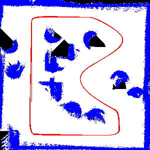

# LIDAR-based Robotic Mapping

This project implements a robotic mapping system using the ePuck robot platform in Webots, featuring LIDAR-based scanning, coordinate transformations, and real-time map generation.

## Project Overview

The robot follows a line path while simultaneously building a map of its environment using LIDAR sensor data. The system transforms sensor readings from robot coordinates to world coordinates and visualizes the map in real-time, distinguishing between free space, obstacles, and the robot's path.

## Project Structure
```
Lab 4/
├── README.md
├── worlds/                # Webots world files
├── controllers/           
│   └── csci3302_lab4/     # Robot controller implementation
│       ├── csci3302_lab4.py  # Python controller 
│       └── map.png           # Generated map (created during execution)
└── ...                    # misc files
```

## Example Generated Map



The image above shows our robot's generated map of the environment after completing the course 5 times. The map displays free space in white, obstacles in blue, and the robot's path in red.

## Technical Components

### 1. LIDAR Data Processing
- Processes LIDAR range readings across a 90° field of view
- Filters out readings beyond maximum sensor range
- Transforms polar coordinates (distance, angle) to Cartesian coordinates

### 2. Coordinate Transformations
- Robot-to-World coordinate conversion using transformation matrices
- Proper handling of robot orientation in coordinate calculations
- Pixel mapping for visualization (converting meter-scale to pixel grid)

### 3. Line Following Navigation
- Ground sensor-based line detection
- Detection of start/finish line for automatic map saving

### 4. Map Generation
- Real-time updating of occupancy grid
- Bresenham's line algorithm for ray tracing
- Color-coded visualization:
  - White: Free space
  - Blue: Obstacles
  - Red: Robot path

### 5. Odometry Tracking
- Continuous position and orientation updates
- Wheel encoder-based motion estimation
- Integration of motion for pose tracking

## Key Features

- **Dynamic Map Building**: Creates a map of the environment as the robot explores
- **Efficient Rendering**: Only updates changed pixels to optimize performance
- **Ray Tracing**: Determines free space between robot and obstacles
- **Automatic Map Saving**: Saves the completed map when crossing the finish line
- **Optimized Processing**: Efficient handling of LIDAR data for real-time operation

## Implementation Details

The mapping system uses a 300×300 pixel grid representing a 1×1 meter arena. The system:

1. Tracks the robot's position through odometry
2. Processes LIDAR readings to detect obstacles
3. Uses ray tracing to identify free space between the robot and obstacles
4. Updates the grid map with new information
5. Visualizes the map in real-time using color coding

## Usage Instructions

1. Load the world file in Webots
2. Ensure display overlays are enabled to see the map visualization
3. Run the simulation to watch the robot follow the line while mapping
4. When the robot completes the course, a map image will be saved as "map.png"
5. Examine the generated map to see the detected environment features

## Visualization Guide

The generated map uses the following color scheme:
- **White pixels**: Confirmed free space
- **Blue pixels**: Detected obstacles
- **Red pixels**: Robot's path through the environment
- **Black pixels**: Unexplored areas

> **Note:** Make sure to disable "hide display overlays" in Webots to see the map visualization during simulation.